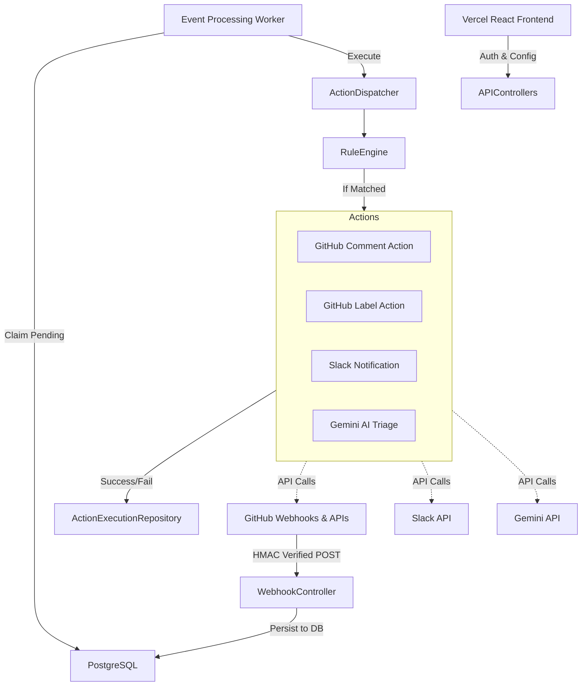

# Event-Driven GitHub Automation Bot Architecture

## System Diagram
The GitHub Automation Bot is structured as a monolithic event-driven system deployed on Render, integrating with GitHub Apps, OAuth, and external APIs (Gemini, Slack).

## Request Flow
1. User logs in via GitHub OAuth to the React SPA frontend.
2. The Vercel frontend talks to the .NET API hosted on Render via securely scoped HTTP-only cookies.
3. User connects a repository (OAuth).
4. The system attempts to resolve a GitHub App Installation ID for enhanced rate-limits and permissions using the App JWT provider.

## Webhook Flow
1. Event occurs in a user's GitHub repository.
2. GitHub sends POST to the webhook endpoint.
3. The API controller validates the `X-Hub-Signature-256` using the per-repository secret.
4. The event is safely persisted as `PENDING` into the `webhook_events` PostgreSQL table.
5. The API controller immediately returns `202 Accepted` to GitHub.

## Worker Flow
1. A background `EventProcessingWorker` loops continuously.
2. It claims `PENDING` or `RETRYING` events using a `SELECT ... FOR UPDATE SKIP LOCKED` pattern to prevent concurrent processing locking issues.
3. The worker parses the event payload and retrieves the repository's configured rules.

## Rule Engine
The Rule Engine lives completely in the Domain layer and processes logical matching cleanly without database calls.
Supported Rules:
- `TitleContains`
- `AuthorEquals`
- `LabelContains`

## GitHub App Authentication
- Users can install the "Event Automation Bot" on their GitHub repositories.
- The system checks for the App Installation ID. If it exists, the system mints temporary Installation Access Tokens using a secure Private Key encoded JWT.
- If not installed, it seamlessly falls back to the user's OAuth access token.

## Multi-Repository Architecture
Every repository acts as an isolated security tenant.
- Rules are strongly tied to a `ConnectedRepository.Id`.
- Webhook events are tied to a `ConnectedRepository.Id`.
- The rule engine will only evaluate rules that belong explicitly to the repository the webhook originated from.

## Major Design Decisions
- **Postgres as a Queue**: Avoiding external dependencies (Kafka/Redis) keeps the architecture cheap (Free Tier) and simple.
- **Dual-Loading UX**: The frontend is explicitly designed not to flash skeletons during startup, providing a premium application landing experience.
- **Fail-Safe AI**: Gemini is treated as an unreliable downstream component with its own primary and fallback models to prevent generic 503 failures from halting the queue.
